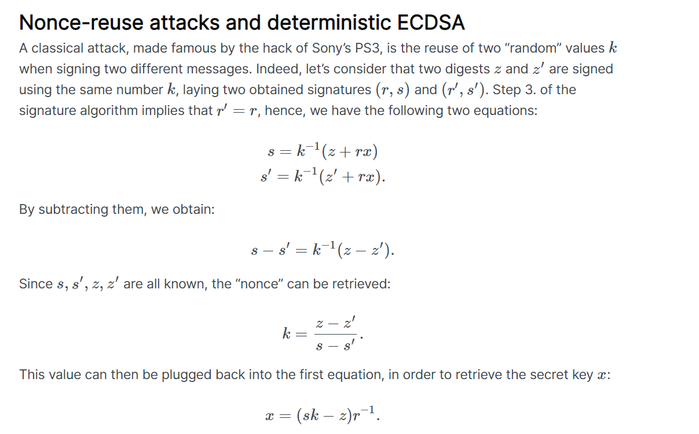

# Trusted 2

> Following the leak of an important database in the Sagittarius sector, it has been decided to rework the whole security of the information system.
> Make sure that the authentication portal is this time secured as it should be.

In this chall, we are given a [trusted.py](https://github.com/CongKhaiNGUYEN/congkhainguyen.github.io/blob/main/_posts/CTFs/HackDay2023/Crytography/trusted2.py) and a remote instance running at `sie2op7ohko.hackday.fr:1339`.

Here is the content of the given file:

```python
#!/usr/bin/env python3

import hashlib
from random import randrange
from ecdsa import NIST256p, ecdsa

G = NIST256p.generator
order = G.order()

priv = randrange(1, order)
print(priv)
pub = G * priv

pub = ecdsa.Public_key(G, pub)
priv = ecdsa.Private_key(pub, priv)

k = randrange(1, 2 ** 127)

print(k)

banner = """
 _____              _           _    ___    ___   
|_   _|            | |         | |  |__ \  / _ \ 
  | |_ __ _   _ ___| |_ ___  __| |     ) || | | |
  | | '__| | | / __| __/ _ \/ _` |    / / | | | |
  | | |  | |_| \__ \ ||  __/ (_| |   / /_ | |_| |
  \_/_|   \__,_|___/\__\___|\__,_|  |____(_)___/ 
  
"""

print(banner)

welcome = f"Welcome to the magistrates' systems authentication portal. These systems contain confidential information. By authenticating, you accept our terms of usage and confidentiality policy."
welcome_sig = priv.sign(int(hashlib.sha256(welcome.encode()).hexdigest(), 16), k)
challenge = "All the information in this portal is signed so you can verify its authenticity. To authenticate, please send your login and then its signature."
challenge_sig = priv.sign(int(hashlib.sha256(challenge.encode()).hexdigest(), 16), k)

print(welcome)
print((int(welcome_sig.r), int(welcome_sig.s)))
print(challenge)
print((int(challenge_sig.r), int(challenge_sig.s)))

login = input("Login: ")

user_r = input("r: ")
user_s = input("s: ")

try:
    flag_sig = ecdsa.Signature(int(user_r), int(user_s))

except:
    print("This is not a valid signature!")
    exit(1)

if login != "admin":
    print("User not recognized.")
    exit(1)

elif pub.verifies(int(hashlib.sha256(login.encode()).hexdigest(), 16), flag_sig):
    with open("flag.txt", "r") as flag:
        print("Welcome back, magistrate.", flag.read())
else:
    print("The signature does not match.")
```


The challenge entails logging in as an administrator using a valid ECDSA signature, despite not knowing the private key. Upon examining the script, it becomes apparent that the same nonce k is reused twice, posing a significant security problem.

This blog shows an effective attack for this case [link](https://blog.ledger.com/whitebox_ecdsa/)




At the moment, we must solve the modular equation by utilizing the values for welcome_sig.r, welcome_sig.s, challenge_sig.r, and challenge_sig.s. This will allow us to derive the values for both k and secretkey. I wrote a Python script to solve this problem, which is provided below:

```python
from ecdsa import SigningKey, NIST256p, ecdsa
from ecdsa.util import sigencode_string, sigdecode_string
from ecdsa.numbertheory import inverse_mod
import hashlib
import gmpy


def attack(publicKeyOrderInteger, welcome_sig, challenge_sig, welcome_hash, challenge_hash): 
    r1 = welcome_sig[0]
    s1 = welcome_sig[1]
    r2 = challenge_sig[0]
    s2 = challenge_sig[1]

    #Convert Hex into Int
    L1 = int(welcome_hash, 16)
    L2 = int(challenge_hash, 16)

    if (r1 != r2):
        print("ERROR: The signature pairs given are not susceptible to this attack")
        return None

    numerator = (((s2 * L1) % publicKeyOrderInteger) - ((s1 * L2) % publicKeyOrderInteger))
    denominator = inverse_mod(r1 * ((s1 - s2) % publicKeyOrderInteger), publicKeyOrderInteger)

    privateKey = numerator * denominator % publicKeyOrderInteger
    	
    k=((L1 - L2) * gmpy.invert(s1 - s2, publicKeyOrderInteger)) % publicKeyOrderInteger

    return privateKey, k

if __name__ == "__main__":
    welcome_msg = str("Welcome to the magistrates' systems authentication portal. These systems contain confidential information. By authenticating, you accept our terms of usage and confidentiality policy.")
    challenge_msg = str("All the information in this portal is signed so you can verify its authenticity. To authenticate, please send your login and then its signature.")

    sk = SigningKey.generate(curve=NIST256p)

    vk = sk.get_verifying_key()

    # We will receive these when connect to the server
    r1, s1 = (111391044781181099898621006745964519964370211680257872447623523323208411606006, 100398559010779323791307625279057034441528039874592265012681523507075607609967)
    r2, s2 = (111391044781181099898621006745964519964370211680257872447623523323208411606006, 108010935937086225987349138870931134823994791317514068872230958438782733606218)

    welcome_hash = hashlib.sha256(welcome_msg.encode()).hexdigest()
    challenge_hash = hashlib.sha256(challenge_msg.encode()).hexdigest()


    G = vk.pubkey.order
    privateKeyCalculation, k = attack(G, (r1,s1), (r2,s2), welcome_hash, challenge_hash)
    print(privateKeyCalculation)
    print(k)


```

```bash
python3 get_secretKey.py 
110696857466129509077483454225251595212153217266429454059370529521872581383283
52308005918054812860398182701925793980
```

Where r1,s1,r2 and s2 are the values we will get when connecting to the server by

`nc sie2op7ohko.hackday.fr 1339`.

After the calculation is done, we will generate the necessary information using the code below

```python
#!/usr/bin/env python3

import hashlib
from random import randrange
from ecdsa import NIST256p, ecdsa

G = NIST256p.generator
order = G.order()

priv = int(input("priv > "))
pub = G * priv

pub = ecdsa.Public_key(G, pub)
priv = ecdsa.Private_key(pub, priv)

k = int(input("k > "))

sig = priv.sign(int(hashlib.sha256("admin".encode()).hexdigest(), 16), k)

print((int(sig.r), int(sig.s)))
```

```bash
$python3 generate.py 
priv > 110696857466129509077483454225251595212153217266429454059370529521872581383283
k > 52308005918054812860398182701925793980
(111391044781181099898621006745964519964370211680257872447623523323208411606006, 94071814645923634210732485488455467439127904709299771620426100379479682850179)
```

Going back to netcat we get the flag after entering all the information

```bash
Login: admin
r: 111391044781181099898621006745964519964370211680257872447623523323208411606006
s: 94071814645923634210732485488455467439127904709299771620426100379479682850179
Welcome back, magistrate. HACKDAY{n3v3r_r3u53_n0nc35_1n_3CD54}
```

Flag: `HACKDAY{n3v3r_r3u53_n0nc35_1n_3CD54}`